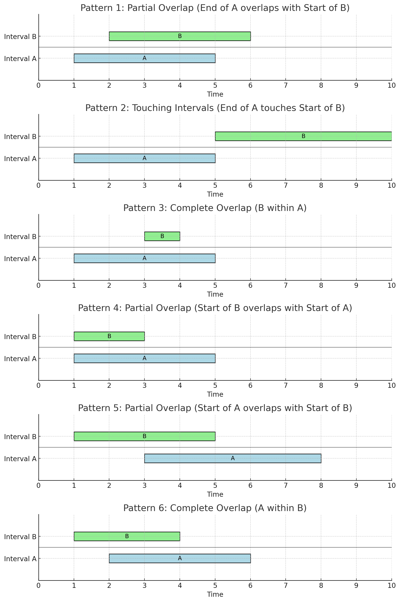

# Merge Intervals 

## Explanation

"Merge interval" is a common pattern used to solve problems where we need to find overlapping intervals. In most 
interviews, you will encounter problems where you must find overlapping intervals or merge overlapping intervals. This 
pattern might also be used to solve a sub-problem within a larger problem.

Two intervals can overlap in one of the six ways mentioned:
1. **Partial Overlap (End of A overlaps with Start of B)**: Interval A: [1, 5] Interval B: [2, 6]
2. **Touching Intervals (End of A touches Start of B)**: Interval A: [1, 5] Interval B: [5, 10]
3. **Complete Overlap (B within A): Interval A**: [1, 5]  Interval B: [3, 4]
4. **Partial Overlap (Start of B overlaps with Start of A)**: Interval A: [1, 5] Interval B: [1, 3]
5. **Partial Overlap (Start of A overlaps with Start of B):** Interval A: [3, 8] Interval B: [1, 5]
6. **Complete Overlap (A within B):** Interval A: [2, 6] Interval B: [1, 4]

If you sort the interval values base on start interval, you will only have four ways in which an interval will overlap

1. **Partial Overlap (End of A overlaps with Start of B)**: Interval A: [1, 5] Interval B: [2, 6]
2. **Touching Intervals (End of A touches Start of B):** Interval A: [1, 5] Interval B: [5, 10]
3. **Complete Overlap (B within A)**: Interval A: [1, 5]  Interval B: [3, 4]
4. **Partial Overlap (Start of B overlaps with Start of A):** Interval A: [1, 5] Interval B: [1, 3]

An interval which are sorted base on start will overlap if  b[start] <= A[end]

## Algorithm 

1. Sort the intervals on the start time to ensure a.start <= b.start. 
2. If ‘a’ overlaps ‘b’ (i.e. b.start <= a.end), we need to merge them into a new interval ‘c’ such that:
        c.start = a.start
        c.end = max(a.end, b.end)
3. We will keep repeating the above two steps to merge ‘c’ with the next interval if it overlaps with ‘c’.

References: https://medium.com/codex/grokking-the-coding-interview-pattern-merge-interval-6e6b1e9e038c